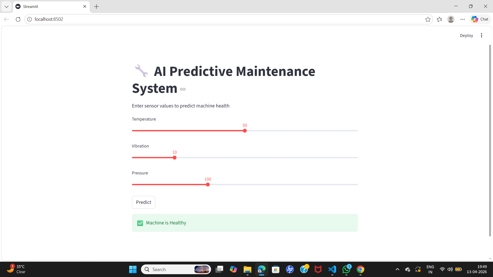
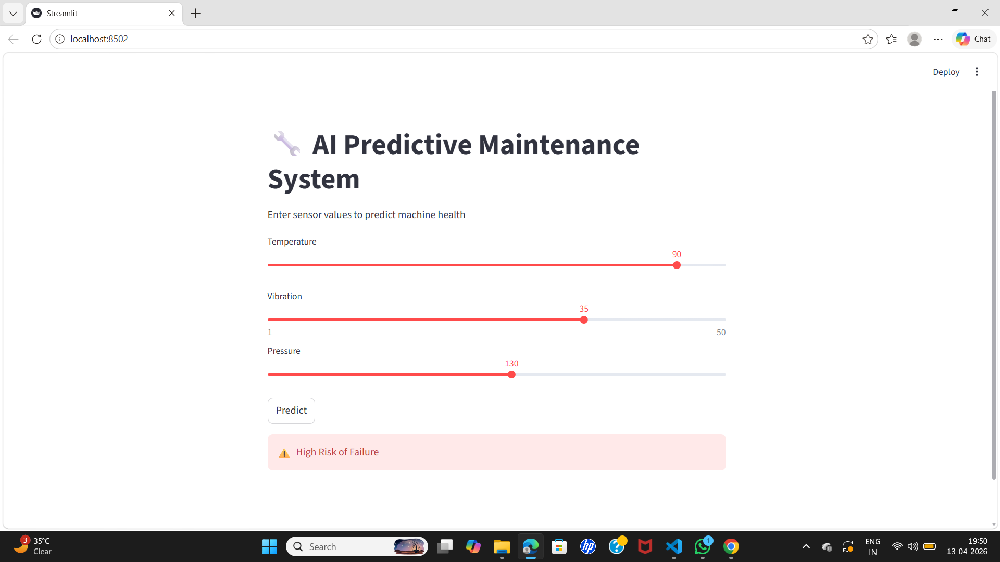

## 🔧 AI-Powered Predictive Maintenance System for IoT Devices

---

## 📌 Overview

This project is an AI-based system that predicts machine failures using IoT sensor data such as temperature, vibration, and pressure. It helps industries detect potential issues before breakdown occurs, enabling proactive maintenance and reducing downtime.

---

## ❗ Problem Statement

Traditional maintenance approaches are:

- Reactive (fix after failure)
- Preventive (fixed schedule)

These methods lead to:

- Unexpected breakdowns
- High maintenance costs
- Production loss

👉 This project solves the problem by predicting failures in advance using Machine Learning.

---

## 🏭 Industry Relevance

This system is widely applicable in:

- Manufacturing plants
- Industrial factories
- Power generation systems
- Automotive systems
- Aviation maintenance

### 💡 Benefits:

- Predict machine failures
- Reduce downtime
- Save maintenance cost
- Improve operational efficiency

---

## 🛠 Tech Stack

- Programming Language: Python
- Libraries: Pandas, NumPy, Scikit-learn
- Visualization: Matplotlib, Seaborn
- Model: Random Forest Classifier
- UI: Streamlit
- Version Control: Git & GitHub

---

## 📊 Dataset

The dataset simulates IoT sensor data including:

- Temperature
- Vibration
- Pressure
- Failure (0 = No Failure, 1 = Failure)

📁 Location:

data/raw/data.csv

---

## 🏗 Architecture

Sensor Data → Data Preprocessing → Feature Engineering → Model Training → Prediction → Dashboard

---

## ⚙️ Installation

1. Clone the repository

git clone https://github.com/keshkarsaloni-lab/Predictive-Maintenance-AI.git
cd AI-Predictive-Maintenance-IoT

2. Create virtual environment

python -m venv venv

3. Activate environment

Windows:

venv\Scripts\activate

Mac/Linux:

source venv/bin/activate

4. Install dependencies

pip install -r requirements.txt

---

## ▶️ Usage

Train the model

python src/train_model.py

Evaluate the model

python src/evaluate_model.py

Run prediction

python src/predict.py

Run dashboard

python -m streamlit run app/app.py

---

## 📈 Results

- Accurate prediction of machine failures
- High accuracy (~80–100% on sample dataset)
- Real-time prediction via dashboard

---

## 📸 Screenshots

### 🔹 Dashboard

### 🔹 Prediction (Healthy)

### 🔹 Prediction (Failure)

---

## 🎯 Learning Outcomes

- Built an end-to-end Machine Learning pipeline
- Learned data preprocessing and feature engineering
- Implemented classification model (Random Forest)
- Developed interactive dashboard using Streamlit
- Understood IoT data simulation and predictive maintenance
- Gained hands-on experience with GitHub project deployment

---

## 👩‍💻 Author

Saloni Keshkar

---

